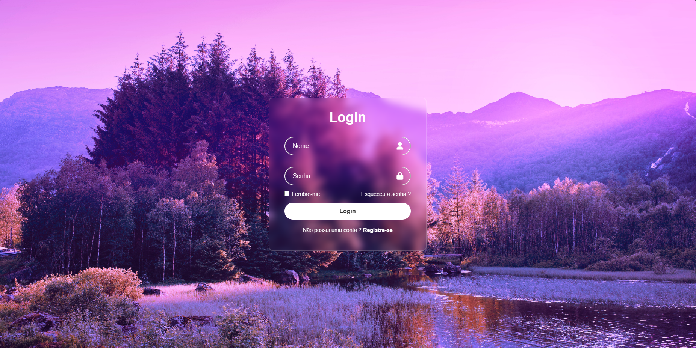

# Login

## ✅Sobre o Projeto
Criação de uma simples página de login

## 🔗 Layout


## 💻 Tecnologias utilizadas

&nbsp; &nbsp;

## 📌 Como executar o projeto

```
# clonar o repositório
git clone https://github.com/Rayane-Souza/Login.git

# Entrar na pasta
 cd login 

 # Abra o projeto no navegador
clicando com o botão direito no arquivo HTML e selecionando "Abrir com" ou "Open with live server"
```
## Autora
Rayane Souza

<a href="https://www.linkedin.com/in/rayanekelly/" target="_blank"></a>
